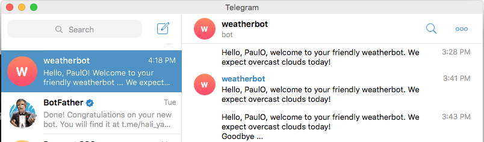

# Weather Bot

> A friendly telegram bot that describes the weather today in your location ...

The program creates and initiazes a Telegram bot. The program then retrieves the user name for a friendly greeting. Then program then uses a geolocation API service to detect your country location using your IP address. The longitude and latitude from the location data retrieved using the IP address is used is then passed on to weather API to provide the name of the local region and the weather description which is then displayed as part of the greeting in the telegram message from the telegram bot. 
When running the program you can use a VPN to change your location and you will see a greeting with the weather description of your chosen country and region! :)

## Built With

- Ruby
- Telegram

## APIs

- BotFather (https://core.telegram.org/bots/api)
- http://api.openweathermap.org
- https://reallyfreegeoip.org

## Getting Started

To get a local copy up and running follow these simple steps:

### Prerequisites - Ruby and Telegram bot

Make sure you have the latest version of Ruby installed for your operating system from https://www.ruby-lang.org/en/downloads/
Check using using 'ruby -v' on the command line to make sure it is at least version 2.1 and above.

Install Telegram on your device from https://telegram.org/ and make sure you have a working telegram account. Access the weatherbot from: t.me/hali_ya_anga_bot

### Setup

Clone https://github.com/paulo-techie/weatherbot to your working folder

### Install Gems

From the command-line type the following to install required gems:

gem install telegram-bot-ruby

gem install dotenv

gem install rspec

### Usage

Make sure you are in the working folder or move to it using either one of the following on the command line: 
cd weatherbot 
chdir weatherbot

Run the program using the following:

ruby bin/main.rb

### Run tests

Run RSPEC tests using the following on the command line:

rspec

## Author

👤 Paul Omondi

- Github: [@paulo-techie](https://github.com/githubhandle)
- Linkedin: [@paul-o-43051a31](https://www.linkedin.com/in/paul-o-43051a31/)

## 🤝 Contributing

Contributions, issues and feature requests are welcome!

Feel free to check the [issues page](issues/).

## Show your support

Give a ⭐️ if you like this project!

## Acknowledgments

- Hat tip to anyone whose code was used
- Inspiration
- etc

## 📝 License

This project is [MIT](lic.url) licensed.
