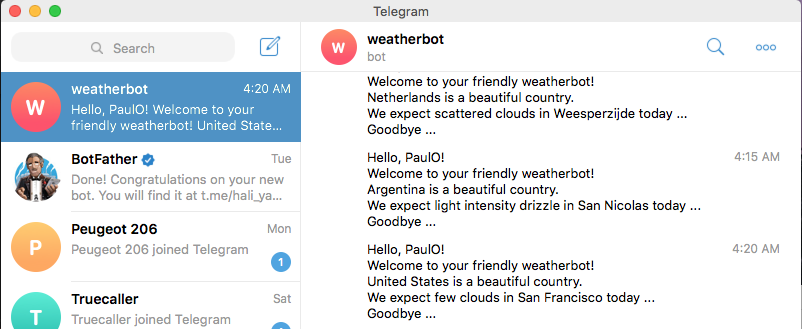

# Weather Bot

> A telegram bot that describes today's weather ...

Additional description about the project and its features.

## Built With

- Ruby

## Getting Started

**This is an example of how you may give instructions on setting up your project locally.**
**Modify this file to match your project, remove sections that don't apply. For example: delete the testing section if the currect project doesn't require testing.**

To get a local copy up and running follow these simple example steps.

### Prerequisites

Ruby

### Setup

Copy weatherbot folder to your working directory

### Install

gem install telegram-bot-ruby
gem install open-weather
bundle install

### Usage

ruby bin/main.rb

### Run tests

rspec

## Authors

👤 Paul Omondi

- Github: [@paulo-techie](https://github.com/githubhandle)
- Linkedin: [@paul-o-43051a31](https://www.linkedin.com/in/paul-o-43051a31/)

## 🤝 Contributing

Contributions, issues and feature requests are welcome!

Feel free to check the [issues page](issues/).

## Show your support

Give a ⭐️ if you like this project!

## Acknowledgments

- Hat tip to anyone whose code was used
- Inspiration
- etc

## 📝 License

This project is [MIT](lic.url) licensed.
